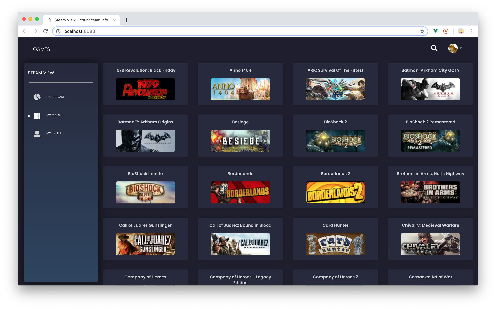

# Steam View

A webapp that uses several API calls to display information for the requested Steam user.
[View demo](https://wannesverelst.me/playground/steam-view)

## Local installation
- Install all needed node modules
```sh
npm install
```
- Add [your Steam API key](https://steamcommunity.com/dev/apikey) in the file 'GlobalVariables.js' that can be found in the folder 'process'
- In the project directory, run the following script to start a server that makes the API calls
```sh
node server.js
```
- To open the project locally, run the following script in the terminal
```sh
npm run dev
```

## Built With
* [VueJS](https://vuejs.org/) - The Progressive JavaScript Framework
* [Bootstrap](https://getbootstrap.com/)
* [Black Dashboard](https://demos.creative-tim.com/black-dashboard/) by Creative Tim
